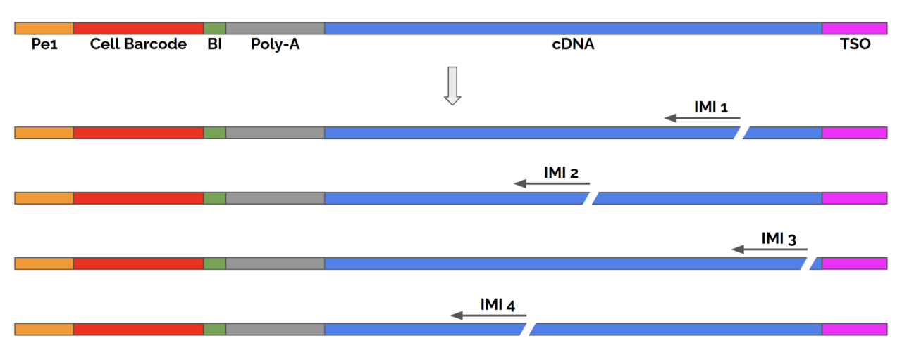
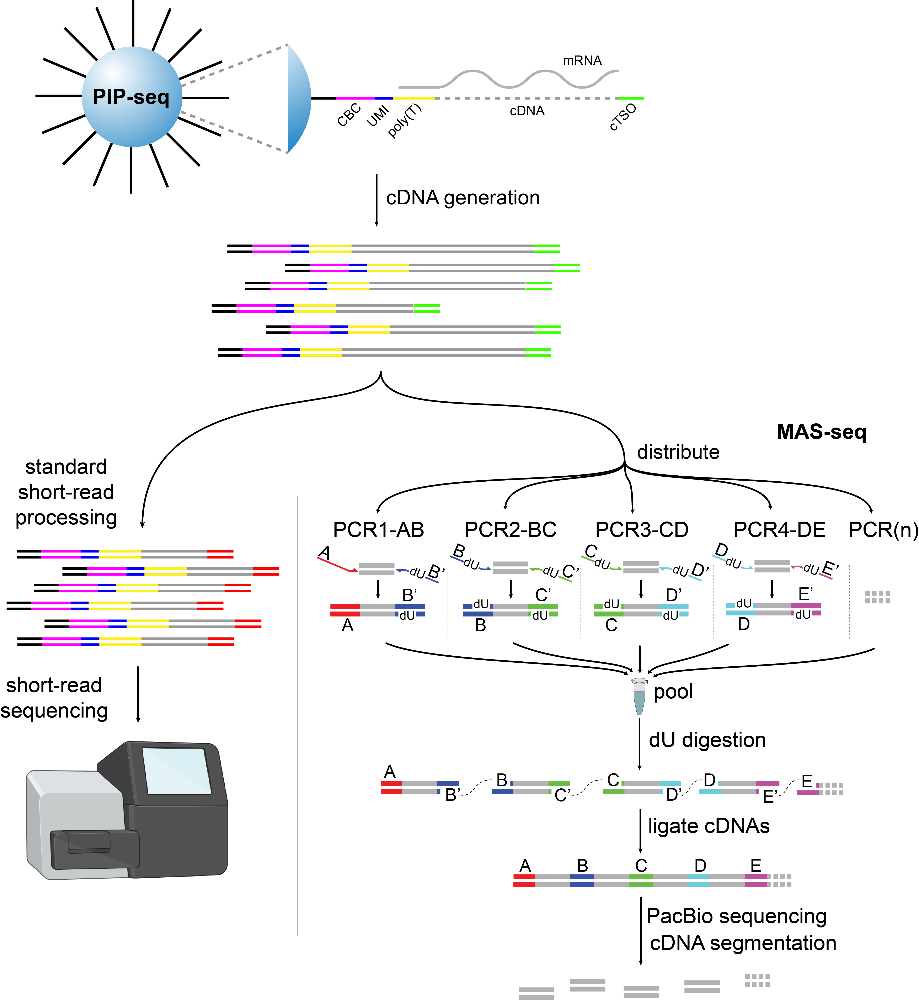

# 1.试剂盒

| 名称         | T2                                                            | T10                  | T20                       | T100                |
|------------|---------------------------------------------------------------|----------------------|---------------------------|---------------------|
| 细胞数量       | 2000                                                          | 10000                | 20000                     | 100000              |
| read depth | load 5K cells,100M reads per sample                           | 17K cells,340M reads | load 40K cells,800M reads | 200k cells,2B reads |
| Notes      | identification of subpopulations ≥ 20% of all cells or nuclei | ≥ 10%                | ≥ 5%                      | ≥ 1%                |

# 2.培训视频

[Illumina Single Cell Prep training page](https://support.illumina.com.cn/sequencing/sequencing_kits/illumina-single-cell-prep/training.html)

# 3.数据预处理PIPseeker(以后可能不再更新) or DRAGEN single Cell RNA App v4.4

# 4.高级分析Partek Flow software

# 5.数据预处理PIPseeker_Report.html报告模版

[PIPseeker_Report](./PIPseeker_Report.html)

# 6.单细胞测序商业化产品评估

[De Simone M, Hoover J, Lau J, et al. A comprehensive analysis framework for evaluating commercial single-cell RNA sequencing technologies[J]. Nucleic Acids Research, 2024: gkae1186.](https://academic.oup.com/nar/advance-article/doi/10.1093/nar/gkae1186/7924191?login=false)

# 7.测序读长

read 1:at least 45 cycles
read 2:at least 72 cycles

# 8.文库结构

# 9.测序建议

NextSeq 500/550 recommended final library loading concentration 1.6 pM including ≥ 1% PhiX

NextSeq 2000 recommended final library loading concentration: 550 pM including ≥ 1% PhiX.

NovaSeq 6000 final library loading concentration 210 pM including ≥ 1% PhiX (equivalent to Pooled Loading Concentration of 1.05 nM).

NovaSeq X Series final library loading concentration 190 - 200 pM including ≥ 2% PhiX.

# 10.blc2fastq拆分：single-cell analysis software does not require trimmed fastq.gz files.

**no QC or adapter trimming when converting BCL to fastq.gz files**

# 11.Single-Cell Isoform Sequencing of Fluent Libraries with MAS-seq 

三代全长也可以来自Broad CLINICAL LABS验证:https://broadclinicallabs.org/single-cell-isoform-sequencing-of-fluent-libraries-with-mas-seq/

